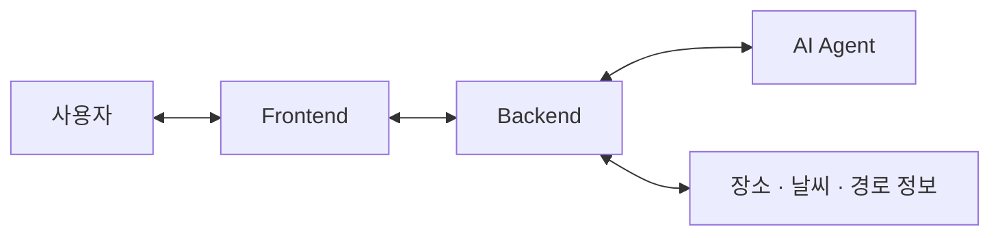
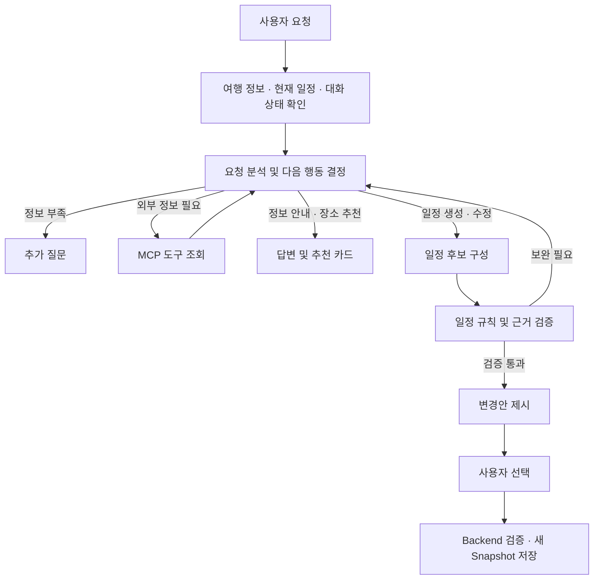

# Tripatch

**여행 중 발생하는 변수에 맞춰 현재 일정을 재설계하는 AI 여행 서비스**

[서비스 바로가기](https://tripatch.fun)

> 애플리케이션 소스 코드는 포함하지 않습니다.

## 프로젝트 소개

### 배경과 목표

갑작스러운 비, 예상보다 길어진 이동 시간은 여행의 다음 일정까지 바꿉니다.
여행자는 현장에서 대체 장소를 검색하고, 경로와 방문 조건을 확인하며, 남은 일정을 다시 구성해야 합니다.

Tripatch는 이러한 **'여행 중 다시 계획해야 하는 부담'** 을 줄이기 위해 개발했습니다.
국내 자유여행객을 대상으로, 기존 여행 일정과 사용자가 전달한 상황을 함께 분석하여 변경안을 제안합니다.
사용자는 변경 내용을 비교한 뒤 원하는 대안을 선택하고 여행을 이어갈 수 있습니다.

### 핵심 시나리오

> “오후에 비가 온대. 야외 일정을 실내에서 보낼 수 있는 일정으로 바꿔줘.”

1. 현재 여행 지역·기간·일정과 변경 요청을 확인합니다.
2. 필요한 장소·날씨·경로 정보를 조회하고 대체 일정을 구성합니다.
3. 일정 규칙과 확보된 정보를 바탕으로 후보를 검증합니다.
4. 사용자가 변경안을 확인하고 선택하면 새 일정으로 저장합니다.

실시간 변수 대응은 **사용자가 요청한 시점의 조회와 대화**를 중심으로 동작합니다.
혼잡 상황도 사용자가 채팅으로 전달하여 대체 일정을 요청할 수 있습니다.

### 개발 역할

- **AI Agent:** 대화 기반 요청 처리, 외부 정보 조회, 일정 후보 생성·검증, 대화 및 실행 상태 관리
- **Backend 연동:** Agent 호출 계약, 내부 인증, 장소 정보 연동, 추천 카드 저장, 여행 삭제 시 대화 정리
- **서비스 통합:** 직접 장소 검색과 추천 카드의 화면 연동, 통합 테스트, 컨테이너 배포 구성

## 주요 기능

| 기능 | 사용자 경험 | 구현 포인트 |
|---|---|---|
| 대화 기반 일정 생성·수정 | 자연어로 일정 초안을 요청하거나 기존 일정 변경 | 여행 메타데이터·현재 일정·대화 맥락을 활용하고 정보 부족 시 추가 질문 |
| 상황에 맞춘 일정 재설계 | 날씨 변화·이동 지연·선호 변화에 맞는 대안 확인 | 장소·날씨·경로 조회와 일정 검증을 거쳐 변경안 구성 |
| 추천 장소 카드 | 장소명·주소·분류·추천 이유·지도 링크 확인 | 검색 근거가 있는 장소 ID 사용, Backend에서 장소 정보 재확인, 사진은 확보된 경우 표시 |
| TourAPI·NAVER 통합 검색 | 직접 검색한 장소를 일정에 연결하여 저장 | TourAPI 우선 조회 후 결과 부족·실패 시 NAVER 보충 |
| 유연한 일정 표현 | 방문 시각 또는 날짜·시간대 중심으로 일정 구성 | 시간 정밀도를 구분하고 미정인 시각을 임의로 확정하지 않도록 처리 |
| 변경안 비교·선택 | 원하는 대안을 선택한 뒤 일정에 반영 | 후보와 확정 일정을 구분하고 선택 시점에 검증·저장 |
| 일정 기록과 복원 | 변경 이력을 확인하고 이전 일정으로 복원 | 불변 Snapshot을 보존하고 선택한 버전 활성화 |
| 대화 기록 복원 | 새로고침 후 이전 대화와 추천 카드 확인 | 대화 메시지와 카드 데이터 영속 저장 |

## Architecture

### 서비스 구성

Tripatch는 사용자 화면, 여행 데이터를 관리하는 Backend, 대화와 일정 제안을 담당하는 AI Agent로 구성됩니다.

| 구성 요소 | 역할 |
|---|---|
| Frontend | 여행 일정·지도·채팅 화면을 제공하고 추천 장소와 변경안을 표시 |
| Backend | 사용자와 여행 데이터를 관리하고 선택한 일정의 검증·저장을 담당 |
| AI Agent | 여행 맥락과 요청을 이해하고 필요한 정보를 활용하여 일정 대안을 제안 |
| 외부 정보 연동 | 장소·날씨·경로 정보를 여행 추천과 일정 검토에 활용 |

### Agent 처리 흐름

## Tech Stack

| 영역 | 기술 | 활용 |
|---|---|---|
| Frontend |    | 여행 일정·지도·채팅·추천 카드 UI |
| Backend |   | 인증, 여행 데이터 관리, 일정 검증 및 API 제공 |
| AI Agent |     | 요청 분석, 도구 호출, 일정 대안 생성 및 실행 흐름 관리 |
| 도구 연동 |  | Agent와 Backend 사이의 여행 정보 조회 도구 계약 |
| Database |   | 여행·일정·대화·Agent Checkpoint 영속 저장 |
| Session / Migration |   | 로그인 세션 공유 및 DB 스키마 변경 관리 |
| Cache |  | Agent의 일정 조회 캐시 |
| Infrastructure |    | Frontend·Backend·Agent 배포와 API 프록시 |
| Container / Registry |   | 서비스 이미지 빌드 및 배포 이미지 관리 |
| 외부 데이터 |    | TourAPI·NAVER 장소 검색·기상청·경로 API를 통한 장소·날씨·이동 정보 조회 |
